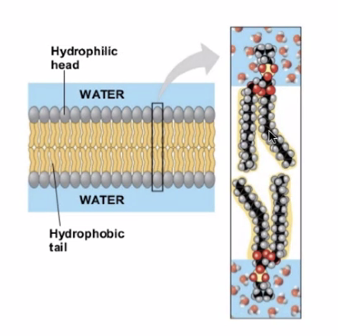

# Fluid mosaic model of cell membrane

Some Phosopholipids connected as a "phosolipid bi-layer" (see [[KBhBIO101StructuresOfLipids]] structure 

- Charged head
- Nonpolar tail

So, head aligns and tail aligns, creating the basic structure of the membrane:

This is called the "fluid mosaic" model because there is nothing holding these together.

## Stuff in the membrane
**Cholesterol**

Helps cells communicate

**Proteans**

- Makes sure the right molecules gets in/out
- Nonpolar Oxygen + CO2 could easily get through
- Polar and charged molecules can't get through, unless...
- Channeled proteins let specific polar particles through

Through various [[KBhBIO101CellMembraines]] protean transports, chemicals could get in and out of the cell.