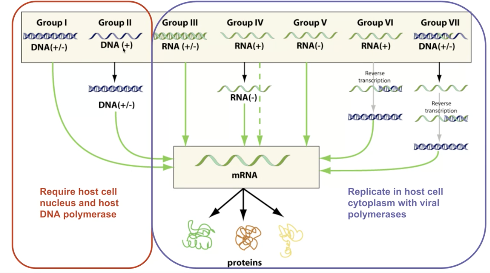

# Overview of Human Diseases
A lecture by the Legendary Dr. Paul Hauser. [Slides are here](https://docs.google.com/presentation/d/1b2RetU6iGsd_h4Msb2SV-_WznNXSREbsPpfdY-LgJZs/edit#slide=id.ga6d683dbbf_0_338)

#flo #disorganized 

**Disease** is an abnormal condition that causes impairment in/loss of function of an organism (a.k.a. decreased fitness) that is not due to immediate external injury.
	
* What causes human disease?
	* Infectious agents
	* Deficiency disorders
	* Heritable factors
	* Physiological disorders (immunodeficiency, autoimmune disorders, allergies, etc.)
	
## Congenital vs. Acquired disease

Congenital diseases => diseases present at birth due to DNA abnormalities / pregnancy pathological issues

Acquired diseases => diseases that begin during lifetime, including...

* Microrganism invasion => "infectios diseases"
* Autoimmune reaction
* Nutrient deficiency
* Mechanical wear
* Ingestion of noxious chemicals

**Infectious diseases actually smaller on the causes of death in the US**

* Heart disease => wear + deficiency 
* Cancer => heritable + DNA
* Unintentional injuries => not a disease
* Chronic respitory disease => wear
* Stroke => not a disease
* Alhetimer disease => wear
* Diabetes => autoimmune, nutrient, wear
* Influenca <= **here, finally, an infections disease.**

## Disease causing agents
* **Protozoan** => single-celled eukaryotes
* **Fungal** => single/multi-celled eukarotyes
* **Bacteria** => single-celled prokaryotes
* **Viral** => acellular parasitic infectious agent
* **Helminuthus** => multicellular worms
* **Prions** => acellular misfolded proteins
* **Viroids** => infections nucleic acids w/o protein coat to make virus

## Pathogenicity + Virulence

**Pathoginecity** => relative capacity to cause disease

- Non-pathogenic agents => no diesease
- Primary pathogens => yes disease
- Opportunistic pathogens => yes disease only when it can, for instance, in immunocompromised individuals

**Virulence** => numerical measures for pathonicity

- Measured experimentally with LD50 + ED50

***

## Overview of various diseases

[This video](https://drive.google.com/file/d/1WRnbgkhnmRrdP4ZqlqT3HHBD1_eW9qib/view)

### Protozoan

* **Protozoan factors** => direction pathogenisis leading to tissue damage
* **Host-mediated factors** => immune evation + escape mechnisms + immunalsupression

Adaptable!!

### Fungal

* **Fungal factors** => many shapes and very adaptable, colud produced specialized enzymes to take root in body
* **Host-mediated factors** => cause immunocomprimzation, acquired though inhalation, etc.

### Bacteria

* **Bacterial-induced toxicity** => produces toxins + has hard capsule cell
* **Host-mediated factors** => may develop host resistance, could compete for resources, and could be grown introcellularly


***

## Bacteria causing diseases

**Biofilm formation**

- Communities of bacteria could work together by adhering and exchanging information
- Bacterial could perform quorum sensing => exchange of information with each other + recognize various members of their group

### Fighting bacterial infections

**Antibiotics** => drugs with selective toxicity for specific bacterial types

Act by...

* Disrupting membrane + cell wall integrity
* Selectively target + impair bacterial ribosomes
* Block bacterial DNA replication/transcription
* Inhibit bacterial metabolism

## Viruses causing diseases
**Viruses: acellular macromolecular assemblies**

* Contain protein coat called capsid
* DNA or RNA, but not both
* Are obligate parasites that could only replicate within host

	
* Assembled and mature viral particles => virions, which contain...
	* Capsid
	* Genetic material
	* Occationally outside lipid layer 
	
=> Viruses exist on the nanometre scale, but they are difference in share and size

### Structure of viruses
* **All contain**
	* Capsid => structural protein coat
	* Genome => RNA/DNA; but not both
* **Some contain**
	* Membraneous-enclosed capsid => envelope
	* Externally-facisg host-cell fusion proteins => spikes
	* Viral genome replication enzymes => prlymerases
	* Other proteins for fun => enzymes, motor proteins, transcription factors, host-cell interacting proteins, etc.
	
### Two types of virus 
* **Prokaryotic-infecting viruses**
	* Variety of shapes
	* Complex and prolate shapes
	* Has, sometimes complex shapes! a la [this image](Screen Shot 2020-10-12 at 10.49.04 PM.png)
* **Eukarotic-infecting viruses**
	* Much more "boring" in terms of shape
	* Icosahedral/spherecial outside
	* Enveloped constructions => envelope protein layer outside, spherical inside
	* Helical/Cylindrical/Bullet shapes, too!
	* Often single patterns assemble together to create symmetric shape that creates the whole of the virus 


### Viral Life Cycle
1. Attachment => protein contact between virus and host
2. Viral entry/Uncoating => shedding the protein layer
3. Biosynthesis => make baby viruses
	1. Genome Replication: transcribe DNA/RNA
	2. Genome Expression: read DNA/RNA to make proteins
4.  Viral genome integration => retrovirus only
5.  Assembly => put it all togethr
6.  Viral Exit => mature virons leave

#### Viral Entry

*Option 1: Direct Injection/insertion*

- Insert genome through the bi-layer
- Leave the rest behind
- Tada!

*Option 2: Endocytosis*

- Trick the host cell into introducing the virus as food
- Endocytosis!
- Bam

*Option 3: Fusion*
 
 - Virus fuse with cell membrane
 - Shed the protein coat once in
 - Shazam!

**All of these involve attachment first, which usually takes two steps.**

This process causes the organism-specific response to viruses:

1. Attachment: adhere roughly to random sugar proteins
2. Binding: roll over slowly, and bind to the entry receptor it needs

#### Uncoating
* Virus triggers *early endosome*
	* Causes pH dependent protein denaturation
	* Causing the capsid to fall apart
	* Triggering *late endosome* => releasing genome

#### Viral Replication
Key questions:

- **How are viral mRNAs produced from the viral genome?** => virus will hijack the ribosomes in the host cells. So, it is more important to ask how the mRNAs are produced to tell ribosomes what to do
- **What serves as the template for viral genome replication** => replication will need a polymeraese; but the source and mechanism is dependent on viral genome structure/composition



**DNA Viruses**

*How are viral mRNAs produced from the viral genome?*

- Viral DNA enters, through RNA polymerase II in the host cell, mRNA is produced
- mRNAs then read  by ribosomes, and there we go

*What serves as the templates for viral genome replication?*

- Viral DNA serves as template for host cell DNA polymerase
- Viral genome copied repeatedly
- Virus, then, **will be replicated within the nucleus** due to it needing the polymerase to copy DNA

Except! Poxvirade carry their own polymerase, so they replicate in the cytoplasm.


**RNA Viruses**

*How are viral mRNAs produced from the viral genome?*

* +Strand: reproducable RNA => could be directly translated by the ribosomes
* -Strand RNA: useless template RNA (less easy to be detected)
	- Need to be processed by RDRP (RNA-dependent RNA Polymerease)
	- Once entered the cell, RDRP goes to work copying -Strand RNA to +Strang RNA 

- double-stranded RNA viron => (+, a.k.a. sense) 
	- +-stranded RNA => same idea as above
	- - strand RNA => virus comes with RDRP that convert -ssRNA to +ssRNA. Then, same idea as above. 

*What serves as the templates for viral genome replication?*

* RNA viruses does not need host-cell polymeraese to copy RNA
* They come with polymerase that...
	* with dsRNA; takes +ssRNA and makes -ssRMA; combining the two to produce dsRNA
	* with +ssRNA, takes +ssRNA and makes temporary -ssRNA which makes more +ssRNA
	* with -ssRNA, takes -ssRNA, and makes temporary +ssRNA, which makes -ssRNA


#### Packaging

Does not require ATP. Just sealed in.

#### Viral Exis

**Lysis**

Replicate so much that the membrane burst.

**Budding**

Trigger...

- Trigger extocytosis
- Meanwhile, send virus's own spikes to the membrane
- On exit by extocytosis, steal a part of the newly-spikey membrane with it to serve as new casing

### Viral Genetic Shift + Viral Genetic Drift

**Shift** => whole segments of genome exchange abruptly as two flu viruses infect the same cell to create a new strand.

**Drift** => single/groups of nucleotides flip slowly over time.

The former is an environment-dependent process, where the latter is able to be modeled as it is due to transcription mistake.

### Retroviruses + How to Stop Them
**Viruses that have the ability to intergrate into the chromosomes of the host cell**

#### Early Events

* Viruses is uncoated, and uses an enzyme called reverse transcriptase to turn ssRNA to cDNA, and finally into dsDNA
* Then, the enzyme integrase threads the viral dsDNA into the cell's nucleaus
* HIV protease cuts HIV polyproteins into individual parts ready for budding

#### Late Events

* Proviral region is transcribed slowly whenever ribosome comes across it by the host DNA polymerase II to make viral proteins + replicate the viral genome
* Components are later exported, assembled, and slowly released through budding

To make this happen, the virus needs...

- **Reverse Transcriptase**
	- Transcript RNA to double-stranded RNA
	- Take double-stranded RNA to turn into DNA
- **Integrase**
	- Force insert the DNA into the genome of the host cell

And because of the fact that viral DNA is now in cellular DNA, these viruses' DNAs are hard to get rid of.

And this is why we can't cure HIV.

Virus, in this case, spread through cell duplication

* Proviral region on the DNA, every time the ribosome comes across it, makes a new viron
* These components are then assembled, sent, etc. as usual
* Because of the fact that the ribosome needs to, well, come across the bit of DNA for this to work, the virons are made slowly by "trickling out.


**Preventing Retroviruses**

* Prevent Fusion `gp120`, `gp41`, `CCR5`
* Prevent reverse transcription `RT`
* Prevent intergration via intergrease `IN`
* Prevent viron maturation `PR`


* Most advanced: HAART (Highly-Active Anti-Retroviral Therapy)
	- Cocktail drug works together for inhibition
	- Two drugs to stop intergration, one to stop protease (viron maturation)
	- Could develop resistance

### Viral Genome vs Mutation Rate


- RNA viruses could mutate more because it does not have checks
- More complex+largest viruses harder to mutate

**Genetic drift** — viruses mutate due to polymerase error

**Genetic shift** — viruses recombinate without mutating by crossing-over mechanism or genome segment reassortment. Think! the flu

 
## Why are viruses bad

Damage host cells/tissues by...

* Reducing gene expression capacity
* Depleting cellular resources
* Causing cell lysis (to explode)
* Promoting tumorigenisis — cancer
* Creating damaging immunological response

## Preventing Viruses

Let's talk about **Remdesivir**! A drug developed by Pfizer that's used to combat Ebola + influenza viral replication.

 Modified nucleotide triphosphate which adds onto the RNA strand copied by the RNA-Dependent RNA Polymerase carried by viruses
 
* Pretends + gets inserted as a nucleotide
* Once added onto the RNA chain, jams further actual nucleotides from being inserted

 _Could_ but usually does not jam up normal RNA polymerase which does normal transcription
 
* Inhibiting transcription in the short term won't kill you immediately
* So, we hurt normal cell transcription a little in order to rid of the virus
* Need hospital treatment for regular and safe dosing for this exact reason


# CN10212020

## Making Proteins, a guide

**Genetic Code** => "nucleotide code" found in the DNA that helps make protein. There are two parts of this: translation and transcription.

- The process of **Transcription** involves taking the DNA, separating it, and copying its corresponding pairs to RNA
- The process of **Translation** involves taking the RNA and making proteins.

Occasionally, the RNA is what we want to end up with, so then obviously we no longer need the process of Translation.

### Transcription => converting DNA to mRNA
* Done by RNA Polymerase Enzyme
* Rip apart hydrogen bonds using DNAse enzyme
* Read one side ("template strand", a.k.a. noncoding strand) of the double helix, recognizing each nucleotide
* Pluck the correct corresponding nucleotide out of the nucleus
	* G->C
	* C->G
	* A->**U**
	* T->A
* Prokaryotes lack membrane-bound nucleus (or any organelle)

\definition{Gene}{information that successfully encodes a functional protein or a functional catalytic RNA}

RNAs could also be catalysts!

* "Promoter"s denotes beginning of a gene. "Terminator"s denotes the end of gene.

**Starting Transcription**
* Series of utility "factors" proetins begin to assemble to call the attention of RNA polymerase. (#how + #when does this happen? #ASK)
* RNA polyamerase binds to the Sigma Subunit => form a holoenzyme to unwind DNA
* Sigma subunit informs the enzyme where to find a promoter (beginning of binding)
* "Enhancer" gene sequences help bind with activator proteins to help attract RNA polymerase II


**Promoters**

* Polymerase Enzyme starts at a promoter (typically found upstream of the 5' start site) and ends at a terminator
	* Box of TATTAA highlights transcription rate and the start site
	* TFIIA cofactor in RNA recognizes TATTAA box, TFIIB recognizes C/CG/CG/CGCCC upstream
* Stronger promoters/enhancers => "enhance" "more." i.e. tumor viruses strengthen promoters for cell growth


**Terminators**

* Found in the end of the template sequence
* Two types in prokaryotes
	*  Rho-independent terminators — roll back onto itself, causing the RNA to terminate and mRNA to be release
	*  Rho-dependent terminators — activate cofactor named rho + unwind the transcribed RNA-DNA hybrid
* In Eukarotes
	* Pol I genes — transcription stopped through termination factor by unwindng the transcribed RNA-DNA hybrid
	* Pol II genes — don't stop until the end, but a polymerase has a "cleavage" mechanism that clips the end out using a poly(A) tail consensus sequence

### Before we continue, two words
- *Non-coding sequence*: metadata for DNA for the processors
- *Coding sequence*: DNA content for amino-acid production

### mRNA processing => splicing mRNA
Pre-process the mRNA. 

**Prokaryotes does not do this!** Prokarotes' coding sequence always makes a full protein, so we just start at promoter and end at terminator and make a protein!

In Eukaryotic DNA...

Between Promoter and Terminator, **Exon** and **Intron** alternate. Exon is coding, whereas Intron is non-coding and works as metadata.

After reading the intron, they are spliced out during mRNA processing => done by the "splicesome". The mRNA, after splicing, is "capped and tailed" to mark pre-processing completion, at which point they leave the nucleus + go to the ribosome.

* Begin by assembling helper proteins at intron-exon borders => "slicing factors"
* Other helping factor proteins come together and form the "splicesome" to do the splicing
* Splicesome splices by bringing exon ends together
* After it's done, the splicesome disintergrates

### Translation => RNA-directed polypeptide synthesis
Mature mRNA sent to ribosome. mRNA must travel to the cytoplasm in the Eukarotes to catch the RNA, whereas in prokarotes they don't have to go anywhere.

Ribosomes has two units: 50S unit + 30S unit => they come together whenever a mRNA needs it. Each contained specialized rRNA + tTRNA to catalyze attachment of and carry amino acids + adapt the incoming mRNA respectively.

**Note! The beginning of mRNA is not translated.** There a portion on the 5' end of the mRNA (starts with AGGAGG) — about 170 nuclotides in humans, and shorter in bacteria — that's called UTR (untranslated region.) This region helps ribosomes bind to it + stablize the binds.

* 3 protein factors IF1, IF2, IF3 forms a complex for transcription by binding to a subunit on the ribosome
* Methionine-carrying tRNA binds to the start of the mRNA, which forms the initiation complex. This is typically removed after translation if not coded for (f M-A amino acid pair coded for, methonine removed; but if M-L pairs coded for, methonine not removed.)
* A-site: translates mRNA to tRNA — anti-codon pairs
* P-site: amino acid dumped from tRNA to the actual chain being built
* Spent tRNA ejected to the E-site, which is then recycled
* Catalyst tRNA combines with rRNA  to catalyze amino acid peptide bond
* Each codon (group of 3 units in tRNA), matches a specific [[KBhBIO101AminoAcids]]

Smaller ribosome unit grabs, larger attaches + forms amino acid

After the amino acids are assembled, it's time for [[KBe2020bio101refProteinFolding]]. See also [[KBhBIO101Proteins]].

=> Shaperones fold proteins, and if its finds proteins impossible to fold, it flags it using ubiquitin to send to the garbage

***

Eukarotic gene expression is regulated at many stages — prevents error


* Viral proteins are usually easy to assemble


In Prokarotes, there are less steps.

Between the promoter and the actual coding DNA, there is a region named *operator* that allows three types of regulatory molecules to bind to it to alter how the gene is transcribed, namely:

- **Repressors**: proteins that suppress transcription
- **Activators** are proteins that increase the transcription
- **Inducers** catalyses repressors or activators — making either a strenthened activation or repression acting in conjunction with the other regulator

**Question: how are proteins made in the viral genome**

* No viruses produce ribosomes
* Ribosomes become centrally important for the virus
* What serves as the template to make new virus copies

Viruses attempt to overwhelm the enzyme to entry.

* **DNA Polymerase** takes DNA and makes more DNA
	* Duplicates cell DNA
	* Could be hijacked during cell cycle to duplicate DNA viruses
	* DNA viruses may also carry their DNA Polymerease to not wait for the cell cycle
* **RNA Polymerease** takes DNA and makes mRNA
	* Have lower fidelity with an error about 1/100,000
	* Hence why safety mechanism needed

**Capping and Tailing**
* 3' end => AAAAAA tail (using poly-adenine tailing enzyme)
* 5' end => GGGGGG cap (using guanine-capping enzyme)


**DNA** viruses are "less complex", in that as long as they are able to get into the nucleaus, the rest would just be the body's work automatically.

### List of Kool Proteins

| Name | Function |
|---|---|
| RNA Polymerase | _transcripts_: takes DNA and turns into mRNA |
| DNA Polymerase | _replicates_: takes DNA and makes more copy of it |
| RNA-Dependent RNA Polymerase | _replicates_: takes RNA and makes more copy of it. Basically only viruses use it. |
| Promoter | _signals_: DNA signal of the start of the DNA. | 
| Terminator | _signals_: DNA signal of the end of the DNA. | 

***

## DNA Replication and the Cell Cycle

### So, why do cell divide
> The ability to produce organisms more of their kind is one characteristic that best distinguishes living things from nonliving matter

Viruses + Organelles challenge this definition => they are symbiotic and cannot reproduce on their own. We tend to think that cells

* Everyday, 50-70 Billion die => **programmed cell death**
* To compensate this, Mitosis (cell division) happen 
	* Cell divide in opposite directions
	* Two strands ANTIPARALLEL to each other
	
	
### Levels of DNA structure
* DNA Double Helix => Unwrapped, raw DNA
* Histones => coiler proteins at which DNA coils around
	* Four histones
	* H3, H4, H2a, H2b wraps, H1 seals the four together
	* Each protein has 1.65 wraps
* Nucleosomes => stack of 2 histone groups to create a spool of 8 histone proteins wrapping DNA
* Nucleosomes wraps around into a large fiber called "chromatin"
* A pair of chromatin entangle to form a chromasome

### Cell divison process
* Chromesomes line up in equator
* Each chromesome has two chromatid exactly the same
* Microtubials to pull chromesomes appart connected to kinecore, a joint in the chromatid
* Kinetore senses tension, and when it is correct, molecules are sent down the microtubials to send a split signal


**Most cell division results in genetically identical daughter cell**

Each cell, once specialised, chooses what parts of their chromasome to unwrap + permanently wrap.

Difference in transcription results in different phenotypes.

Sperm + Egg (imcomplete cells) combine together to form a "zygote" => a single cell. Each person is from a zygote.

For Eukarotes, cells divide using Mytosis.

[Paul's Cell Cycle Primer](https://docs.google.com/document/d/1TIrgR9VSV3attTK_QP-AOCs33mMoBP0Cz7DQXysKoD0/edit)


### Major Cell Cycle Parts
- G1 => Rest Phase, Gap 1
	- May hit s.a. to volume checkpoint => if ratio too big, the cell is too big
	- May hit diffusion checkpoint => larger cells would need to work harder to transport things to the centre
- S => S Phase, duplicate DNA. 150 mins
- G2 => Rest Phrase, Gap 2. The pairs of DNA begins bundling and condensing; the DNA is also checked upon and verified for consistency
- M => Mitosis!
	- Prophase: condensation of chromasome
	- Chromatin aligns in the center => (metaphase)
	- A divit (DEFINITION?) forms
	- Two chromatin becomes pulled apart => forming two cells via cytokenisis (anephase)
	
Cell regulators are proteins that manage and sheperard the process of cell division. They respond to molecular signals throughout the cell and check for internal signals like DNA damage to control the rate and progress of cell division.
	

	
### DNA Replication Process

DNA replication is known to be "semi-conservative" — meaning that it is a process that pairs a synthesized half of the DNA with an original half of the DNA (i.e. takes the ORIGINAL template strand + makes the NEW coding strand & takes the ORIGINAL coding strand + makes the NEW template strand.)

Because **polymerases copy uni-directionally** => DNA polyemrease move along the 3' to 5' DNA to create a copy 5' to 3'. Meaning, the polymerize is able to add nucleotide onto the 3' end of the DNA.

* Open the DNA at an arbuiturary point using the Helicase
	* Uses two helicase => one open rightward, and one leftward. The movement of the helicase opening the DNA is called the "fork movement"
	* DNA polymerase could only add nucleotides 5' to 3'
	* As helicase open a little bit of the DNA, polymerases rushes to copy the area that opened
		* In the **leading** strand (3' to 5'), polymerase will run alongside the helicase for they are opening and replicating on the same direction
		* In the **lagging** strand (5' to 3'), polymerase will wait until the helicate opens a little segment, and rushes forward and move backwards
			* NOTE: the lagging strand... 1) takes longer to transcribe 2) is done in small chunks (each "rush forward"). Each chunk is called an ogazaki fragment
			

		
* DNA polymersease will REQUIRE a double-stranded area to begin work from, so Primase synthesize already double-stranded RNA primers that DNA polymerease could bootstrap to the single-stranded DNA to begin the replication process (think: create-react-app)


* DNA polymerse will detect unfitting bonds and remove leftover RNA primer bootstrap units to repair them in a process called "proofreading." DNA polimersease is assisted with "glue" ligase to help the DNA polymerease pick out and replace problematic/unneeded nucleotides and perhaps their neighbors. This is where the Ogazaki fragments get joined.


Steps of DNA replication, in Paul's words:

```
- Many proteins work together in DNA replication and repair. 
The process of DNA replication is semiconservative, such that takes place through complementary base pairing of a template strand of parent DNA. 

- The process of replication begins at the origin of replication, forming a replication fork. The enzyme, helicase, unwinds DNA exposing template strands, primase synthesizes RNA primers to begin the process

- Topoisomerase breaks, swivels, and rejoins the parent DNA to relieve strain caused by unwinding. 

- DNA polymerase is the enzyme that catalyzes the process of complementary base pairing of nucleotides to the template strand. 

- New nucleotide strands always for in the 5’ to 3’ direction, therefore the leading strand forms continuously but the lagging strand is formed in Okazaki fragments (still in the 5’ to 3’ direction) and connected by the enzyme ligase. 

- DNA polymerase is able to proofread pairing, and along with mismatch repair enzymes, DNA is carefully check and repair DNA. 

- The end of a DNA molecule are called telomeres (not in circular genome e.g. bacteria), and shorten during each replication (Hayflick limit). Noncoding, repeating units of nucleotides act as protection from losing essential genetic information by shorting. 
```
