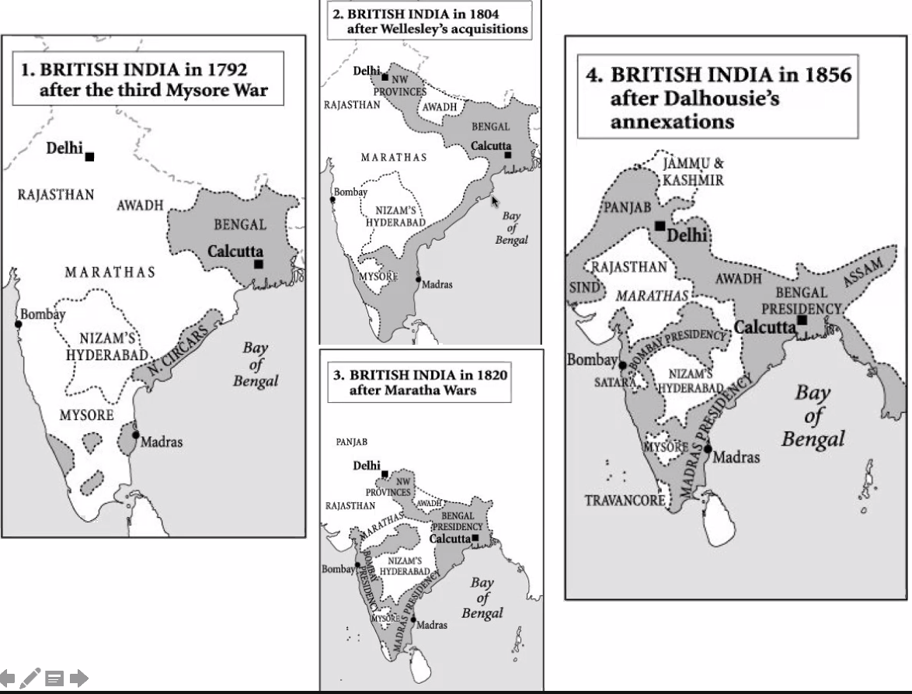

# Roberts Ch. 5

#disorganized 

## India
* England challenged the "Indian Ocean supremacy"
	* England had before sought to enter spice trade of India, but had issues trying to do so
	* Had French interference when trying to do business in India
	* For a century held only Fort St. George and Bombay
	* Conducted trade in Coffee and Textiles
* Coffee!
	* Establishment of coffee-houses of London brought popularity of the drink
	* Tea drinking was also growing at the time
* Company growth
	* East India Co. 1689 defeat pivoted direction to use non-force strategies
	* Collapse of Mughals after 1707 brought energy and land to the British Trade
		* Increased polarity between the Marathas Hindus and the Mughals caused distress
		* Sikhs formed their own sect of Hinduism, detaching from both true Hindu ideology and Islamic ideology
		* 1730s Persian invasion caused loss in territory
	* Britian did not invade the Indian region until much later than the 1740s => CLAIM: because it considered trade very important
		* Finally decided to take action due to CLAIM: hostility towards the French
		* Ownership of station at Calcutta provided access to riches part of India
		* Wanted not to interfere with Indian politics, and instead employ the Mughal model of acceptance-and-profit
	* British vs French conflict
		* Supported opposite Indian princes
		* Brought armed struggle between French and British forces
		* French governor Dupleix controlled brilliantly, but was recalled
		* Provincial government of Bengal attacked + captured Calcutta
		* East India Co.'s army recaptured the city + recaptured both territory of he French and of the governors
		* Recapturing opened the way to British monopoly in India + diminishing of French dominance
	* British Raj
		* Britian proper sent an army to India, legetimizing the corporate armies of the Co.
		* Taking over Mughal government services @sushu
			* TAX FARMING: government gives a person right to collect taxes
		* The Co. formally became ruler of Bengal in 1764
			* French bases became scattered/useless
			* Peace of 1763 left only 5 French trading posts
			* 1769 Compagnie des Indies dissolved
		* Took Cerlon from Dutch year after #verify?
		* Growth => Decline
			*  The company turned a bit too territorialist
			*  Gave employees too many opportunities to cheat/bribe, and not enough profit for the company itself
			*  British government began nationalizing
				*  Set up system of "dual control" in 1784 => lasted until 1858
* Britian successful because of the tax-and-spend cycle
	* Heavy tax to citizen
	* Use tax to fund expansion
	* Citizens get benefit of expansion + don't mind high taxes
* Obviously, this works only if your contry is merchatilist where  

* Roberts => empirization is because of increased commercial opportunity
* Trauttmann => empirization is due to the faliture of the silent Dutch model

* Salt hedge
	* Salt in + opium out
	* 400 miles (SF:Chicago)
	* Controlled the economy

## Carribeans
* Brazil and Carribeans boomed due to sugar crops
* Main crops: tobacco, hardwood, coffee
* Spanish influence on Caribbean agriculture
	* Began with growth of fruit + cattle 
	* Sugar and Rice was then introduced, but production was slow
* European settlements later appeared with the usual suspects => Netherlands, England, French
		* England established 2 colonies => St. Christopher + Barbados
		* St. Christopher => 3000, Barbados => 2000
	* Early successes due to tobacco: "tobacco colonies"
		* Supplied great customs values to England
		* Left the French with 7,000 and England, 50,000 in the island
	* Introduction of sugar crops lead to shift towards Slave trade
		* Tobacco economical if cultivated in small quantities
		* Sugar needed large plantation
		* => Contributed to the overall demographic change in North America
	*  Spanish control now vested on its control of the slave trade
* Eventually, North Amercia emerged to be a bigger economy than that of new Spain  

## Impacts
* Colonies had extracted varied economic benefit from their colonies
	* Spanish => Silver from South America: broke the world economy
	* England =>  Stimulated European exports + manufacturing: leading people to flow from Europe to Africa to Asia
	* CLAIM: colonization of Americas brought huge, incalculable economic benefits
* The Western hemisphere is decidedly European
	* Organized under European legal system
	* Christanized
	
> Europeans did not just conquer; they exterminated local cultures and peoples and replaced them with their own. 

* The older Amercian cultures cut off from populating other parts of the world
* CLAIM: the European dominance was a sign to "Asian Nationalists" (Japan??) as the sign of European injustice
* Americas suffered some species going extinct, and yet others massively planted
	* Plants
		* Potato
		* Sweet potato
		* Maize
	* Domesticated Animals
		* Pigs
		* Sheep
		* Chicken
	* => "Colombian exchange"  
