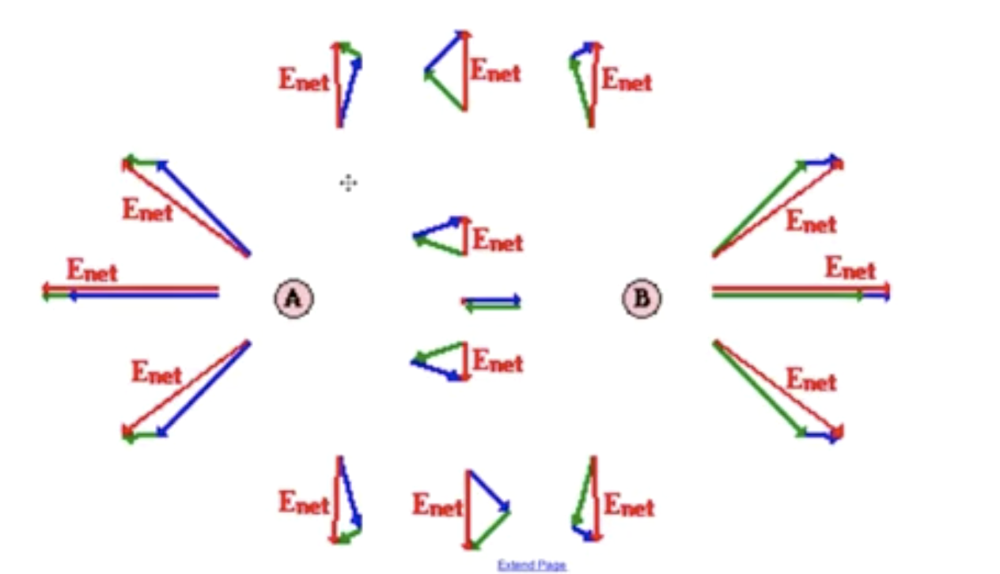

From this note, I am assuming that you have read [[KBhPHYS201IllustratingElectricFields]] Illustrating electric fields.

Imagine if we had… Well… Lot's of vectors:

In this diagram, A + B are both positive. The diagram, now, shows *both* electric field vectors for  A and B. Take, for instance, 

This tidbit:

If we connected it back to A and B, you will get:

As you could see, the force from B is smaller because the point is farther away from B.

Ok, now, let's see the *net* electric field by adding all of these vectors up:

Nice! You are, at this point, hopefully seeing something of a symmetry. Remember how we had two ways of drawing an electric field? That

1) You choose to draw an infinite amount of vectors, or
2) You draw lines from the center of each element outwards, connecting all the vectors

If we do option 2, you see this lovely image:

Please, be also reminded of the fact that the world is 3D, making the diagram more like this:

Great. Lastly there are other possible configurations of charges apart from positive-positive, and they are as follows:

As you could see. There is a lovely point (yes, it's actually a point, but people are lazy and don't to draw, say _infinite_ field lines) in the middle of Neg-Neg and Pos-Pos electric field graphs with a lovely hole.  At that hole, the field value is 0.

(Thanks Mr. Valdez!)

Here's a gallery of electric fields with unequal changes:

As you could see, the higher amount of field lines, the higher is the strengths. If each charge's field "bends" towards the other, (i.e. particles that go _AAAAA I AM GOING TO OVERTAKE THE OTHER PARTICLE'S FIELD LINES_)

However, here's something that you should probably remember: 

**Whenever we are analyzing charge fields of multiple changes "together", remember that we are analyzing the NET electric field.** *Each individual change does NOT feel its own field.* 

This means that, for instance, we drop in a third test charge — it WILL change the NET electric field of all three together, but w.r.t. to the test charge itself, it is only influenced by the net field of the two others.
