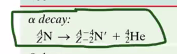
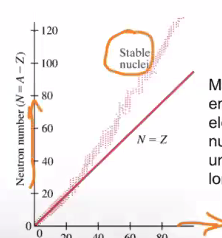

# Nuclear Physics
First of all, recall [[KBhPHYS201ColoumbsLaw]]. Given the force between two particles is $\frac{kQ^2}{R^2}$, we could hand-wavily calculate the _work_ between two particles if we know how much they travel near/far from each other. Through this, we could show that nuclear forces (through nuclear distance, proton=>electron) are much larger than that of the chemical forces (atom/atom, electron=>electron).

#compilefromnote

Remember: $A_{nucl} = \frac{1}{10^{10}} A_{atom}$

## Radioactivity
Radiation is the emition of waves — lights, heat, etc. etc. We call something "radioactive" if it emits ionizing radiation: that it has enough energy to liberate an electron from an atom.

### Geiger Counter
#inserthowgeigercountersowrk

Because of the fact that Geiger counters require time to discharge, there is a certain rate called "dead time" during which Geiger counters simply sit and do nothing. As such, we have to account for this lossy "deadtime" of Geiger counters by relating the two values with the following equation

$T = \frac{M}{1-(M/L)}$, where $M$ is the measured rate of radiation and $L$ is the "dead time" — the upper limit of the Geiger counter in question.

### Radio Charge Types

- $\alpha$: positively charged + relatively massive (low $\frac{q}{m}$)
- $\beta$: negatively charged + relatively high charge (high $\frac{q}{m}$)
- $\gamma$: neutral

This could be seen by how these three types of charge curve into a magnetic field.

Why? Apply right hand rule 1.5.

### Creating a ray
"Split a nucleus, somehow"

**Alpha Decay**:

During alpha decay, a massive nucleolus spits out a Helium-resulting part of itself to get rid of 2 protons and 2 neutrons. So, formally... 

**Gamma Decay**

Instead of splitting part of the nucleus, gamma decay spits an electrically excited (so... chemistry, charged, energy level, that stuff) atom into a normal, non-excited atom and also emits a photon.

And now, the most confusing one...

**Beta Decay**
There's two types of beta decay: "beta-minus" decay and "beta-plus" decay. When folks talk about just "beta-decay", they are talking about beta-minus decay.

An element decays from the parent element into a different nucleus.

_Beta minus decay_

In this case, the nucleus gained a proton and lost a neutron. 

What happened? A neutron in the nucleus turned into a positive proton and a negative electron. The newly-formed electron comes flying out as a "beta-minus" particle. Also, this process creates an "antineutrino", which is a tiny, charge-less element that will become important later.

_Beta plus decay_

This is the opposite of beta-minus decay. The element takes one of its protons, splits it to a positron (a positive electron, this is antimatter), a neutrino, and a neutron.

Wait... But _how_?

Beta-minus decay makes sense, because it would been energetically favorable as a neutron is _slightly_ more massive and hence will loose some of the mass during beta-minus decay. But, during beta-plus decay, the reactants are less massive than the product (!!) --- so thermally it won't really work out.

So, in order to actually create beta-plus decay, you have to shove the protons, antimatter, etc. together really fast with some kinetic energy. Or, this could happen spontaneously as long as the mass of the daughter atom is smaller than the mass of the parent (as in... as long as mass of daughter + mass of anti electron + mass of neutrino < mass of parent, this should work.) 

To make sense of this, stop thinking that atoms' masses could be deducted by just counting the number of neutrons+protons.

_Electron capture_

In this case, you will gain one neutron by simply capturing an electron out of thin air (the electron cloud) and merge it with a proton to form a neutron and an antineutrino.

So, together...

_Positron Capture_

This basically does not happen; it basically should work in a similar manner as does electron capture but the opposite.

You will need lots of pressure to squish two positive things together (Electrons + Protons) to fuse.

### Absorbtion of Radioactivity

As the thickness of the absorber increases, the relative intensity of radiation exponentially, asymtotically decreases.

This is similar to the equatino of a dischanging capacitor; namely $e^(\frac{-time}{\tau})$

Instead of a smooth curve, we will decay by 2. We wil use it like a half life calculation:

$int = 0.5^{\frac{t}{T}}$, where $T$ is the thickness required to absorb 50\%, and $t$ the thickness of the material. $int$ should be the relative intensity of the material --- a percentage (0<=R<=1) that represents how much of the original, unhindered charge is disturbed.

 

Relative intensity + half life problem 3:

### Stopping Rays
$\alpha$, $\beta$, and $\gamma$ rays are strong in that order --- alpha rays could be stopped with less insulation than beta than gamma. HOWEVER, this is given that they all have the same _energy_. Different rays of the same energy would apply like this, but otherwise the energy matters especially for betas.

### Atomic Stability
**Please remember: most nuclei are stable!! Basically everyday things does not give you any meaningful amount of radiation.**

For relatively low protoned atoms, ($p < 30$), stable nuclei is when $N \approx p$. For larger atoms, $N \approx < 1.5P$.

Vocab! Nucleon: neutron + proton.

The standard deviation of $N$ counts is the $\sqrt(N)$ if there is a uniformly random distribution.

## Fission and Fusion
Changes though **fission** (one nucleaus become two pieces, probably due to the partent absorbing a neutron, a.k.a. more equal parts of alpha decay) or **fusion** (two nuclei joining together to form one)

Due to conservation of energy, not every fission/fusion releases energy. If fission of A => B C releases energy, fusion of B+C => A wil not.

You could think of the energy released as part of fission as the potential energy of a system.

The bottom row of "mass number" is nucleons w.r.t. the most common izotope

Iron is a terriable way of getting some energy out of a atom because it has the lowest ever potential energy

Nuclear processes usually end up with Iron; like...

- If you are on the "blue"/"left" region, you release energy by fusioning into iron (add stuff up until you get to stable iron.)
- If you are on the "yellow"/"right" region, you release energy by fissioning into iron (split until you get to iron)

***

But actually this is kind of a lie. It is actully a contour of all different izotopes, measured in "binding" energy and not PE. The **binding energy** is how forcibly the nucleaus are bound together — the more tighly bound, the more energy it would require to break the binding.

Also, Binding Energy is measured in MeV, which convents to Joules with $1 MeV = 1.6 \times 10^{-13} J$.

Nuclear fission is triggered by smushing a neutron into an atom.

For instance...

![[Pasted image 20210118094127.png]]

# Data Shape
| Thickness | Count Rates | Count Time | Result: Normalized Count Rate |
|-|-|-|-|

This will, of course, result in a graph of thickness vs. count rate.

Goal: finding the best T and the +/- range that would fit the rates

![[Pasted image 20210120111507.png]]

## What is "best fit"
![[Pasted image 20210120112247.png]]

When data is uncertain, best fit should minimize $\sum \frac{D_i-M_i}{\sigma_i}^2$. Think as "how many standard deviations away" is the uncertainty. This is also called "pearson's statistic"

With this piece of information, at different discrete values of T, we could have a graph of T vs. S. At the minimum of that curve, that's the best fit!

Smin should be about # of datapoints - # of parametres

If Smin << # dp - # params, you did something wrong.

If Smin >> # dp - # params, sigma were probably underestimated/not the only sources of error

# Lab
1. Apply deadtime correction to both rate and unceartainty in the rate
2. Subtract (background, *no need to correct deadtime here*, propergate error)
3. Divide measured rates by the rate with no absorber to figure the relative rates. Propergate error. This should be 1ish
4. 

***

2 types of nuclear energy generator

1. Pressurized water reactor => Pressured, superheated water superheats nearby water to steam
2. Boiling water reactor => Reactor directly heat

Pressured water reactor has control SCRAM rods above, because steam is not dried within the reactor. Boiling water reactors have control rods below, because the output steam's dryer is above and hence control rods needs to be place below.

The fuel rods contain UO2,with about 3% being U. The rest is the radioactive slowly decaying common 238U. Uranium ore comes out as 0.7% 235U, but we need that to be 3% b/c fissioning 238U is not helpful, so a process called "enrichment" helps purify the Uranium and rid of 238 to leave only 235.

Raw fuel isn't super radioactive. But, once the fuel is insterted, a neutron gets shot in and the recator starts. Control rods could be inserted in to stop teh reaction. #why

Spent fuel is radioactive. Raw U238 does not go through much decay (see... 4.8 Billion Years), but what comes out of the fissioning process is two random elements that could be quite radioactive. 

Also, Plutonium, a result of Uranium fission, also is toxic chemically and emits alpha rays. This could be used as a nuclear weapon in the "emits alpha rays" sense but also used as a slightly more inefficient way of creating lots of heat. Hence, this is fiercely protected.

After fission stops, 5-10 megawatts still gets generated. This, if not cooled by 8g/s of water, will result in zicalloy interaction and hydrogas formation due to chemistry. And that will brow up (and the thing that blows up includes plutonium!). 

The radiation from spent fuel glows blue, because it travels faster than light travels in water so specific rays comes out

In order for the radiation to decay down into standard radiation, one would need to store 10,000+ years for 10% original radiation. However, reprocessving techniques could lower that to around 200 years

Nuclear Radiation ionizez atoms and molecules, which mess things up chemically

***

1 Bq per second means that the source disintgrates once per seciond. 1 currie means that the source disntergrates at 3.7 * 10^10 bq

1rad: a material absorbed 0.01 J per kg of absorbing material. 

Effective dose (rem) = rad * QF (quality factor). For most cases, quality factor is 1 for most common radiation. For neutrons and alpha particles, it is 3 and up to 20 respectively, but the former could only be seen in the middle of a recator or if a bomb just went off and the latter could be block by some sheets of clothing

Rad/Rem/Siverts => Measure of _absorbtion of energy_ per kilogram over time
Bq/Currie => Measure of Emission and source strength

Bottom line: don't worry about the siverts you recieve... unless you eat a radioactive source, because then its emitting in you

Radiation absorbtion results

| Severts number | Effect |
|---|---|
|0.5 Sv immediately|4% chance of cancer during lifetime, no immediate effect|
|1-5 Sv immediately|50% chance of death|
|6+ Sv immediatlely|Bye bye birdy, 30 days|

Note: food sterialized by radioactivity is not radioactive...
